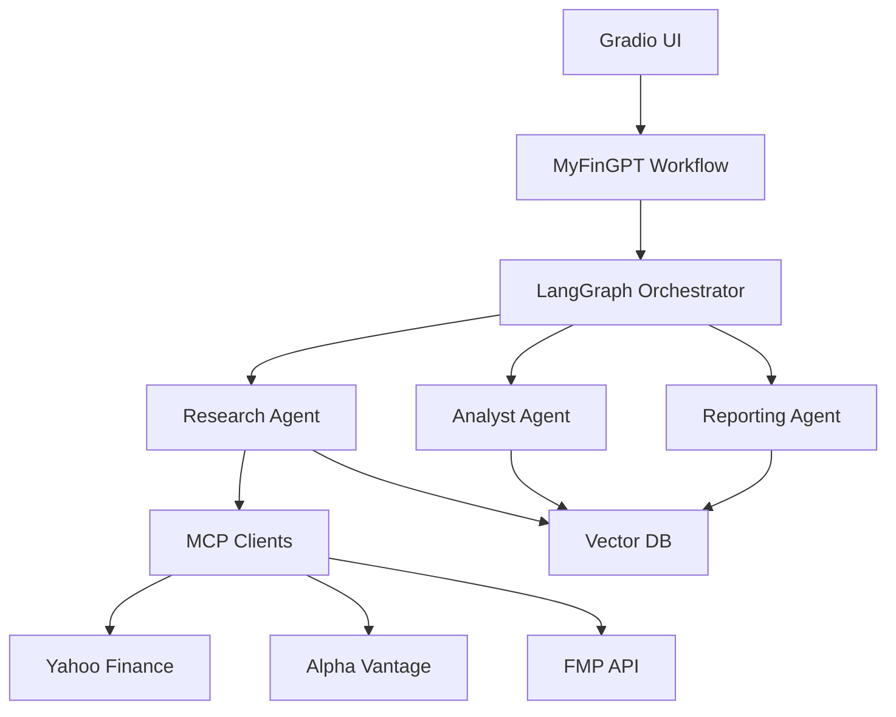
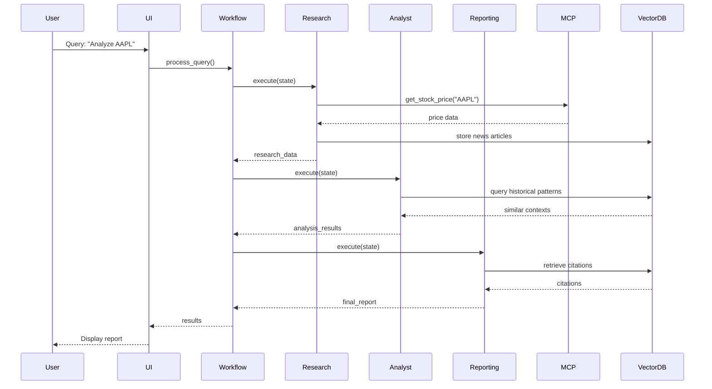
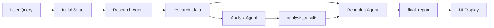

# MyFinGPT Architecture Document

## 1. System Overview

MyFinGPT is a proof-of-concept multi-agent financial analysis system that demonstrates advanced AI agent implementation patterns. The system uses multiple specialized agents working together to provide comprehensive financial analysis with proper context sharing, citations, and token tracking.

### 1.1 System Purpose and Goals

- Demonstrate multi-agent orchestration (sequential and parallel execution)
- Showcase MCP server integration for external data sources
- Implement context sharing between agents
- Provide grounded responses with citations
- Track token usage across agents
- Enable vector database semantic search

### 1.2 High-Level Architecture

```
┌─────────────────────────────────────────────────────────────┐
│                      Gradio UI Layer                         │
│  ┌──────────────┐  ┌──────────────┐  ┌──────────────┐      │
│  │ Query Panel  │  │ Results View │  │ Trend Graphs │      │
│  └──────────────┘  └──────────────┘  └──────────────┘      │
└─────────────────────────────────────────────────────────────┘
                            │
                            ▼
┌─────────────────────────────────────────────────────────────┐
│                  LangGraph Orchestrator                       │
│  ┌──────────────────────────────────────────────────────┐   │
│  │         Agent State Manager (Shared Context)          │   │
│  └──────────────────────────────────────────────────────┘   │
└─────────────────────────────────────────────────────────────┘
                            │
        ┌───────────────────┼───────────────────┐
        ▼                   ▼                   ▼
┌──────────────┐  ┌──────────────┐  ┌──────────────┐
│ Research     │  │ Analyst      │  │ Reporting    │
│ Agent        │  │ Agent        │  │ Agent        │
└──────────────┘  └──────────────┘  └──────────────┘
        │                   │                   │
        └───────────────────┼───────────────────┘
                            ▼
        ┌───────────────────────────────────┐
        │   MCP Servers & External APIs     │
        │  - Yahoo Finance                  │
        │  - Alpha Vantage                  │
        │  - Financial Modeling Prep         │
        └───────────────────────────────────┘
                            │
                            ▼
        ┌───────────────────────────────────┐
        │      Vector Database (Chroma)      │
        │   (Stores embeddings & references)  │
        └───────────────────────────────────┘
```

## 2. Component Architecture

### 2.1 Agent Layer

The system uses three main agents:

- **Research Agent**: Gathers raw financial data from multiple sources
- **Analyst Agent**: Performs analysis, sentiment analysis, and trend identification
- **Reporting Agent**: Synthesizes findings into comprehensive reports

All agents inherit from `BaseAgent` which provides:
- Context reading/writing capabilities
- Citation tracking
- Token usage tracking
- Progress reporting (agent-level and task-level)
- Error handling with context preservation

### 2.2 Orchestration Layer (LangGraph)

LangGraph manages the workflow:
- State management via `AgentState` TypedDict
- Sequential execution: Research → Analyst → Reporting
- Context sharing through shared state
- State transitions and validation

### 2.3 MCP Integration Layer

Unified MCP client wrapper provides:
- Yahoo Finance integration (via yfinance library)
- Alpha Vantage API integration
- Financial Modeling Prep API integration
- Automatic fallback between sources
- Rate limit handling and retry logic

### 2.4 Vector Database Layer

Chroma vector database with:
- Three collections: `financial_news`, `company_analysis`, `market_trends`
- Embedding pipeline using LiteLLM
- **Separate embedding configuration**: Can use different provider/model than LLM calls
- **LMStudio embedding support**: Supports LMStudio embedding models with OpenAI fallback
- Context-aware semantic search
- Historical pattern storage and retrieval
- **Permanent storage**: Data persists on disk until manually deleted

**Embedding Configuration**:
- Configurable via `EMBEDDING_PROVIDER` and `EMBEDDING_MODEL` environment variables
- Supports separate embedding provider from LLM provider (e.g., LMStudio LLM + OpenAI embeddings)
- Model selection priority: env vars > config file > defaults

### 2.5 Context Cache Layer

In-memory caching system (`ContextCache`) with:
- **24-hour TTL**: API query results cached to avoid redundant calls
- **Query history**: Last 100 queries for similarity detection
- **Storage**: Price data, company info, news, historical data, financials
- **Purpose**: Performance optimization and query similarity detection

**Key Distinction: Context Cache vs Vector DB**
- **Context Cache**: Temporary (24h), stores raw API responses, key-based lookup
- **Vector DB**: Permanent, stores text documents with embeddings, semantic search
- See `docs/developer_guide.md` for detailed explanation

### 2.6 UI Layer (Gradio)

Gradio-based web interface with:
- Query input panel
- Progress panel showing real-time agent execution status
- Three tabs: Analysis & Report, Visualizations, Agent Activity
- Real-time progress updates with streaming
- Interactive visualizations (Plotly)
- Execution timeline visualization

### 2.7 Progress Tracking System

Real-time progress tracking infrastructure:
- **ProgressTracker**: Centralized progress event management utility
- **Progress Events**: Stored in AgentState for persistence and debugging
- **Streaming Updates**: Real-time progress updates via workflow streaming
- **UI Display**: Progress panel showing current agent, active tasks, and execution timeline
- **Event Types**: Agent-level (start/complete) and task-level (start/complete/progress) events
- **Execution Order**: Tracks agent execution sequence with timing information

### 2.8 Integration Configuration System

Comprehensive configuration system for LLM provider selection and data source integration control:

**Integration Configuration** (`src/utils/integration_config.py`):
- **IntegrationConfig**: Manages enable/disable state for data source integrations
- **Configuration Sources**: YAML file (`config/integrations.yaml`) and environment variables
- **Data Source Mapping**: Preferred integration order per data type (stock_price, company_info, financial_statements, news, historical_data, technical_indicators)
- **Thread-Safe**: Read-only integration checks ensure parallel execution compatibility

**LLM Provider Configuration** (`src/utils/llm_config.py`):
- **LLMConfig**: Manages LLM provider selection and configuration
- **Supported Providers**: OpenAI, Google Gemini, Anthropic Claude, Ollama, **LM Studio**
- **Configuration Methods**: Environment variables, command-line arguments, config file
- **Provider Templates**: YAML-based templates in `config/llm_templates.yaml`

**Dynamic Prompt Generation** (`src/utils/prompt_builder.py`):
- **PromptBuilder**: Generates dynamic prompts based on enabled integrations
- **Integration-Aware Prompts**: Only mentions enabled data sources in agent prompts
- **Agent Integration**: Reporting Agent, Analyst Agent, and Comparison Agent use dynamic prompts
- **Data Source Availability**: Provides integration availability information to agents

**API Call Optimization**:
- **Smart Source Selection**: Uses preferred integration per data type
- **Stop After Success**: Stops trying other sources once data is successfully retrieved
- **Parallel Execution Preserved**: Optimization happens within each parallel task
- **Status Tracking**: Progress events show API call success/skip/failed status

**Graceful Failure Handling**:
- **Integration Disabled**: Skips API call, logs as "skipped", continues with available sources
- **API Rate Limit**: Retries with exponential backoff, marks as "failed" if all retries fail
- **API Error**: Logs error, marks as "failed", tries fallback integration
- **Partial Success**: Continues with available data, reports partial results

## 3. Data Flow Architecture

### 3.1 Request Flow

```
User Query → UI → Workflow → LangGraph → Agents → MCP/Vector DB → Results → UI
```

### 3.2 Agent Communication Patterns

**Sequential Flow**:
```
Research Agent (writes research_data)
    ↓
Analyst Agent (reads research_data, writes analysis_results)
    ↓
Reporting Agent (reads research_data + analysis_results, writes final_report)
```

**Parallel Flow** (for multiple symbols):
```
Research Agent (Parallel)
    ├─→ Symbol 1 (writes research_data["SYMBOL1"])
    ├─→ Symbol 2 (writes research_data["SYMBOL2"])
    └─→ Symbol 3 (writes research_data["SYMBOL3"])
    ↓
Context Merge
    ↓
Analyst Agent (Parallel)
    ↓
Reporting Agent (synthesizes all)
```

### 3.3 State Management Flow

- Transaction ID generated for each user query (8-character hex)
- Initial state created from user query with transaction ID
- Transaction ID propagated through all log entries
- Each agent reads from and writes to shared state
- State validated at each step
- Context size tracked and optimized
- Final state contains all results including transaction ID

### 3.4 Data Persistence Flow

**Context Cache (24-hour TTL):**
- API query results cached (price, company, news, historical, financials)
- Query history stored (last 100 queries)
- Automatic expiration after 24 hours

**Vector Database (Permanent):**
- News articles stored during research (full article text with embeddings)
- Analysis reports stored after completion (full report text with embeddings)
- No automatic expiration - data persists until manually deleted

**LangGraph State (Temporary):**
- All data during query execution
- Lost after query completion
- Citations tracked throughout execution
- Token usage logged per agent

## 4. Technology Stack

### 4.1 Core Libraries

- **LangGraph**: Agent orchestration and state management (v0.0.40+)
  - Used directly for graph-based workflow orchestration
  - Provides state management via `StateGraph` and `AgentState`
  - Handles sequential and parallel agent execution
- **LangChain**: Listed in requirements but not directly imported
  - Included as a dependency of LangGraph (transitive dependency)
  - No direct LangChain code is used in this project
  - LangGraph provides all needed orchestration capabilities
- **LiteLLM**: Multi-LLM provider abstraction (v1.30.0+)
- **Chroma**: Vector database (v0.4.22+)

### 4.2 Data & Storage

- **Pandas**: Data manipulation
- **NumPy**: Numerical operations
- **ChromaDB**: Persistent vector storage

### 4.3 APIs & MCP

- **yfinance**: Yahoo Finance data (v0.2.28+)
- **requests/httpx**: HTTP clients
- **Alpha Vantage API**: Free tier
- **Financial Modeling Prep API**: Free tier

### 4.4 UI

- **Gradio**: Web UI framework (v4.0.0+)
- **Plotly**: Interactive charts (v5.18.0+)

### 4.5 Utilities

- **python-dotenv**: Environment management
- **pydantic**: Data validation
- **loguru**: Logging

## 5. Deployment Architecture

### 5.1 Component Deployment Model

All components run in a single Python process:
- Gradio UI server
- LangGraph orchestrator
- Agent instances
- Vector database (local Chroma)
- MCP clients

### 5.2 Dependencies Between Components

```
UI → Workflow → LangGraph → Agents → MCP Clients → External APIs
                              ↓
                         Vector DB
```

### 5.3 Scalability Considerations

Current POC design:
- Single-process deployment
- Local vector database
- Synchronous agent execution

Future scalability options:
- Distributed agent execution
- Cloud vector database
- Async/parallel agent execution
- Caching layer for API responses

## 6. Diagrams

### 6.1 System Architecture Diagram



### 6.2 Sequence Diagram - Single Stock Analysis



### 6.3 Context Flow Diagram



## 7. Key Architectural Decisions

1. **Context-First Approach**: State management and context infrastructure built before agents
2. **Unified MCP Client**: Single interface for multiple data sources with fallback
3. **LangGraph for Orchestration**: Leverages LangGraph's state management capabilities
4. **LiteLLM for LLM Abstraction**: Easy switching between LLM providers
5. **Chroma for Vector Storage**: Simple, local, free vector database
6. **Gradio for UI**: Rapid prototyping and simple deployment

## 8. Guardrails and Security Architecture

### 8.1 Guardrails Overview

MyFinGPT implements comprehensive guardrails to ensure the system:
- Only processes financial domain queries
- Validates and sanitizes all inputs
- Prevents injection attacks and malicious content
- Validates stock symbols and data sources
- Ensures agent outputs remain within intended scope
- Maintains system integrity throughout execution

### 8.2 Guardrails Components

**Guardrails Module** (`src/utils/guardrails.py`):
- Centralized validation and security checks
- Query validation (financial domain check)
- Input sanitization (injection prevention)
- Symbol validation (format and content)
- Data source validation (allowed sources only)
- Agent output validation (scope enforcement)
- State validation (structure and content)

### 8.3 Guardrails Integration Points

**1. Query Entry Point (Workflow)**:
- Validates user query before processing
- Sanitizes input to prevent injection attacks
- Extracts and validates stock symbols
- Checks query intent and risk level
- Rejects non-financial domain queries

**2. Agent Execution (Base Agent)**:
- Validates state before agent execution
- Validates state after agent execution
- Ensures agents only operate on valid data
- Prevents state corruption

**3. Data Source Access (MCP Clients)**:
- Validates stock symbols before API calls
- Validates data source names
- Prevents access to unauthorized sources
- Ensures only financial data sources are used

**4. State Management**:
- Uses guardrails for symbol extraction
- Validates state structure
- Ensures state consistency

**5. UI Layer**:
- Handles guardrails errors gracefully
- Provides user-friendly error messages
- Prevents invalid queries from reaching workflow

### 8.4 Validation Rules

**Query Validation**:
- Must be financial domain-related (contains financial keywords or stock symbols)
- Maximum length: 2000 characters
- Must not contain non-financial domain keywords
- Must not contain dangerous patterns (injection attacks)
- Must pass input sanitization

**Symbol Validation**:
- Format: 1-5 uppercase letters, optionally followed by exchange suffix (e.g., AAPL, TSLA.NYSE)
- Must not be common words (THE, AND, etc.)
- Maximum 20 symbols per query
- Must be valid stock symbol format

**Data Source Validation**:
- Only allowed sources: yahoo_finance, alpha_vantage, financial_modeling_prep
- Source names must match allowed list
- Prevents access to unauthorized APIs

**Output Validation**:
- Agent outputs must be financial domain-related
- Maximum output length: 50KB
- Must not contain dangerous patterns
- Must not contain non-financial domain content
- Reporting agent outputs must be financial analysis

**State Validation**:
- Required fields must be present
- Query must be valid
- Symbols must be valid
- Final report must be valid (if present)

### 8.5 Security Patterns

**Input Sanitization**:
- Removes dangerous patterns (XSS, SQL injection, code execution)
- Removes control characters
- Validates encoding
- Prevents null byte injection

**Domain Enforcement**:
- Financial keyword detection
- Non-financial keyword rejection
- Symbol-based intent detection
- Output scope validation

**Error Handling**:
- Guardrails errors are logged
- User-friendly error messages
- System continues operation when possible
- Critical violations stop execution

### 8.6 Guardrails Flow

```
User Query
    ↓
[Guardrails: Query Validation]
    ↓ (if valid)
[Guardrails: Input Sanitization]
    ↓ (if safe)
[Guardrails: Symbol Extraction & Validation]
    ↓ (if valid)
Workflow Processing
    ↓
[Guardrails: State Validation (before each agent)]
    ↓
Agent Execution
    ↓
[Guardrails: State Validation (after each agent)]
    ↓
[Guardrails: Output Validation]
    ↓
Final Results
```

## 9. Security Considerations

- **API Keys**: Stored in environment variables, never logged
- **Input Validation**: All inputs validated and sanitized via guardrails
- **Injection Prevention**: Guardrails prevent XSS, SQL injection, code execution attacks
- **Domain Enforcement**: System only processes financial domain queries
- **Data Source Validation**: Only allowed data sources can be accessed
- **Rate Limiting**: Rate limit handling on external API calls
- **Error Handling**: Prevents data leakage in error messages
- **State Validation**: Ensures state integrity throughout execution

## 10. Performance Considerations

- Token usage tracked per agent
- Context size monitoring and optimization
- Rate limit handling for free-tier APIs
- Efficient vector DB queries
- Caching opportunities for repeated queries
- Guardrails validation overhead is minimal (<1% of execution time)

