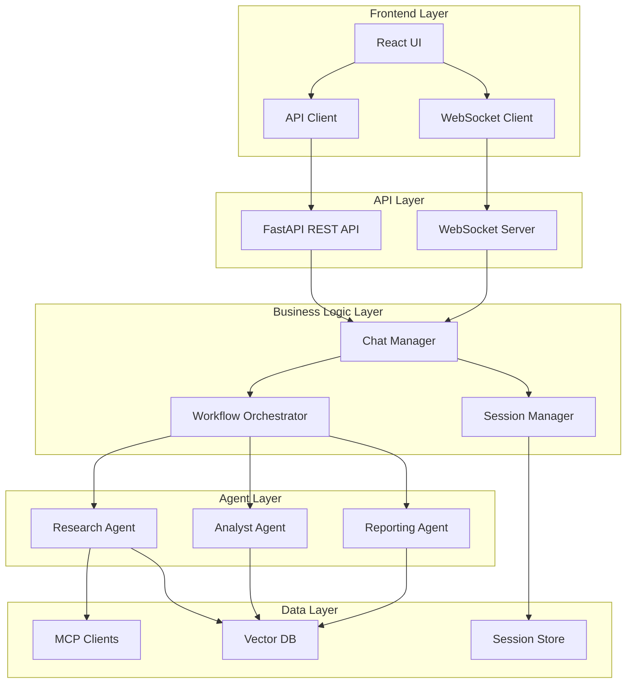
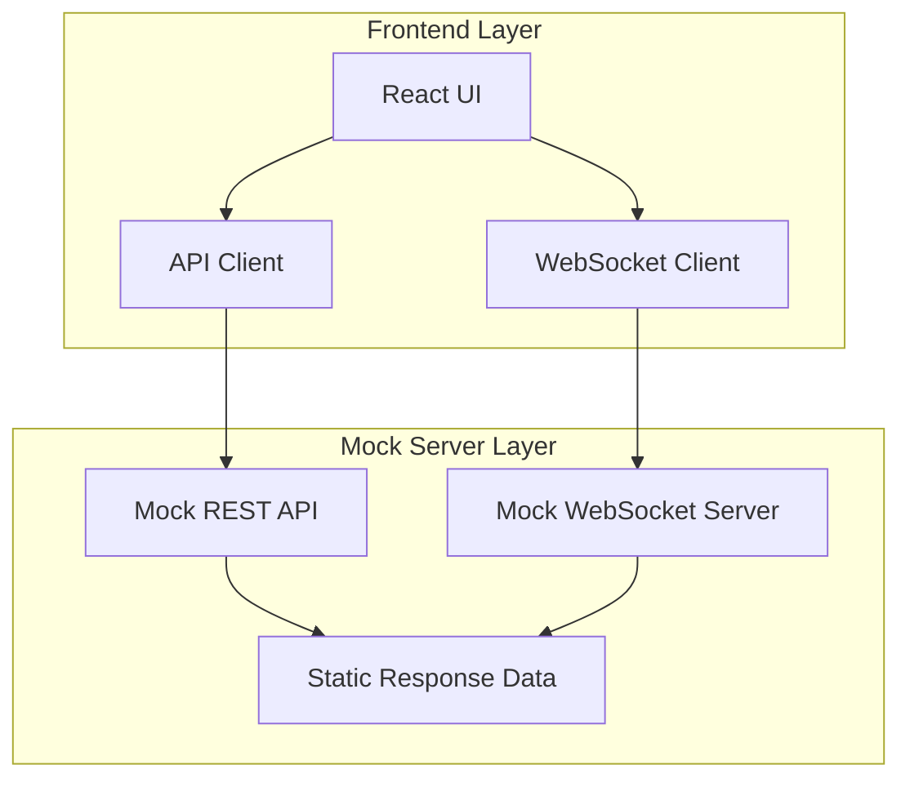
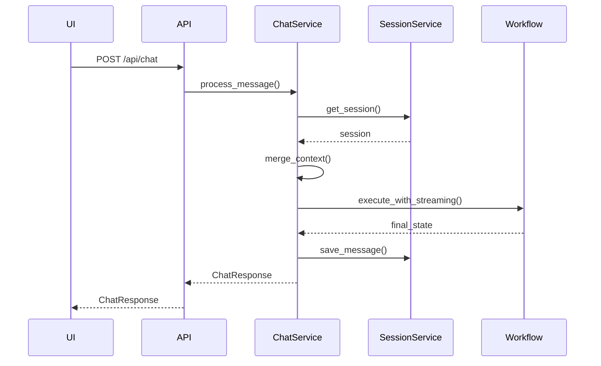
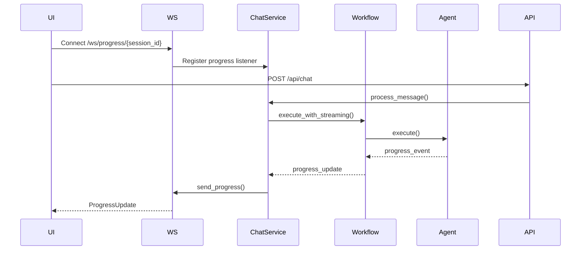
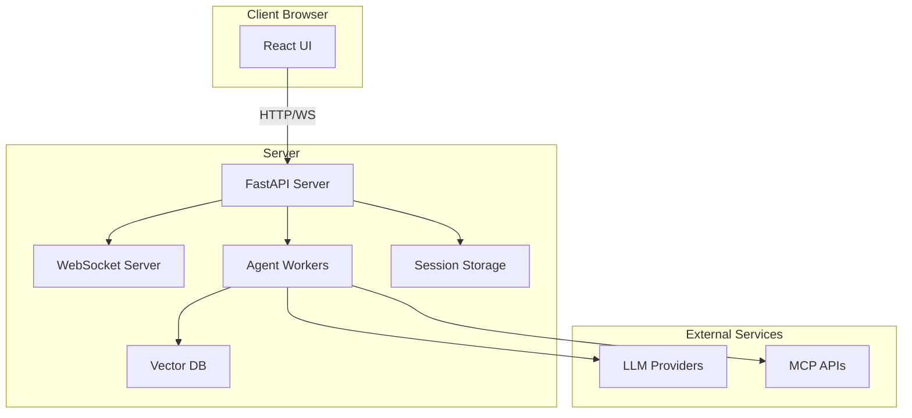

# MyFinGPT Chat - Architecture Document

## 1. System Overview

MyFinGPT Chat is a production-quality rearchitecture of the MyFinGPT POC, featuring a separated frontend (React) and backend (FastAPI) architecture with a conversational chat interface.

### 1.1 Architecture Principles

- **Separation of Concerns**: Clear separation between UI and server components
- **Layered Architecture**: Well-defined layers (Presentation, API, Business Logic, Data)
- **Stateless Frontend**: UI is stateless, state managed on server
- **RESTful API**: Standard REST endpoints for chat operations
- **Real-time Updates**: WebSocket for progress streaming
- **Context Preservation**: Server maintains conversation context per session

### 1.2 High-Level Architecture



### 1.3 Development Architecture (Mock Server Phase)

During UI development, a mock server is used to enable frontend development without requiring agent integration:



**Mock Server Purpose**:
- Enable UI development without agent dependencies
- Test UI layout and behavior independently
- Provide consistent test data
- Validate API contracts before backend implementation

**Mock Server Location**: `fingpt_chat/mock_server/` (separate from actual server)

## 2. Component Architecture

### 2.1 Frontend Components (React)

#### 2.1.1 Component Structure
```
src/
├── components/
│   ├── Chat/
│   │   ├── ChatInterface.tsx       # Main chat container
│   │   ├── MessageList.tsx         # Chat message list
│   │   ├── MessageBubble.tsx        # Individual message
│   │   ├── ChatInput.tsx           # Message input
│   │   └── TypingIndicator.tsx     # Agent typing indicator
│   ├── Progress/
│   │   ├── ProgressPanel.tsx       # Progress tracking panel
│   │   ├── AgentStatus.tsx          # Current agent status
│   │   ├── ActiveTasks.tsx          # Active tasks display
│   │   ├── ExecutionTimeline.tsx    # Timeline visualization
│   │   └── ProgressEvents.tsx      # Progress events log
│   ├── Results/
│   │   ├── ResultsPanel.tsx         # Results container
│   │   ├── AnalysisReport.tsx       # Analysis report display
│   │   ├── Visualizations.tsx       # Charts and graphs
│   │   └── AgentActivity.tsx        # Agent metrics
│   └── Layout/
│       ├── AppLayout.tsx            # Main app layout
│       └── TwoColumnLayout.tsx      # 50/50 split layout
├── services/
│   ├── api.ts                       # REST API client
│   ├── websocket.ts                 # WebSocket client
│   └── session.ts                   # Session management
├── hooks/
│   ├── useChat.ts                   # Chat state management
│   ├── useWebSocket.ts              # WebSocket hook
│   └── useProgress.ts               # Progress tracking hook
├── types/
│   ├── chat.ts                      # Chat-related types
│   ├── api.ts                       # API types
│   └── progress.ts                  # Progress types
└── utils/
    ├── formatters.ts                # Data formatting
    └── constants.ts                 # Constants
```

#### 2.1.2 Key Components

**ChatInterface**
- Manages chat state (messages, session)
- Handles message sending and receiving
- Integrates with WebSocket for real-time updates
- Manages conversation history

**ProgressPanel**
- Displays real-time progress updates
- Shows current agent status
- Displays active tasks
- Renders execution timeline
- Shows progress events log

**ResultsPanel**
- Displays analysis reports
- Shows visualizations
- Displays agent activity metrics
- Updates in real-time as results arrive

### 2.2 Backend Components (FastAPI)

#### 2.2.1 Component Structure
```
server/
├── api/
│   ├── routes/
│   │   ├── chat.py                  # Chat endpoints
│   │   ├── session.py                # Session endpoints
│   │   └── health.py                 # Health check
│   ├── websocket/
│   │   └── progress.py              # WebSocket handlers
│   └── models/
│       ├── chat.py                   # Chat request/response models
│       ├── session.py                # Session models
│       └── progress.py               # Progress models
├── services/
│   ├── chat_service.py              # Chat business logic
│   ├── session_service.py           # Session management
│   ├── context_manager.py           # Context management
│   └── workflow_service.py          # Workflow orchestration
├── agents/
│   ├── base_agent.py                 # Base agent (reused)
│   ├── research_agent.py             # Research agent (reused)
│   ├── analyst_agent.py              # Analyst agent (reused)
│   └── reporting_agent.py            # Reporting agent (reused)
├── orchestrator/
│   ├── workflow.py                   # Workflow (reused)
│   ├── graph.py                      # LangGraph (reused)
│   └── state.py                      # State management (reused)
├── mcp/
│   └── ...                           # MCP clients (reused)
├── vector_db/
│   └── ...                           # Vector DB (reused)
└── utils/
    └── ...                            # Utilities (reused)
```

#### 2.2.2 Key Services

**ChatService**
- Handles chat message processing
- Manages conversation context
- Coordinates agent execution
- Handles intent detection and clarification

**SessionService**
- Creates and manages sessions
- Persists conversation history
- Loads session context
- Handles session expiration

**ContextManager**
- Merges conversation context
- Handles context pruning
- Detects incremental queries
- Manages context window limits

**WorkflowService**
- Wraps existing workflow
- Handles streaming progress updates
- Manages transaction IDs
- Coordinates agent execution

## 3. Communication Architecture

### 3.1 REST API

#### 3.1.1 Endpoints

**POST /api/chat**
- Send a chat message
- Request: `ChatRequest`
- Response: `ChatResponse`
- Creates session if needed

**GET /api/chat/history/{session_id}**
- Get conversation history
- Response: `ChatMessage[]`
- Supports pagination

**POST /api/chat/session**
- Create new session
- Response: `SessionResponse`

**DELETE /api/chat/session/{session_id}**
- Delete session and history

**GET /api/health**
- Health check endpoint

#### 3.1.2 Request/Response Flow



### 3.2 WebSocket Communication

#### 3.2.1 WebSocket Endpoint

**WS /ws/progress/{session_id}**
- Real-time progress updates
- Sends `ProgressUpdate` messages
- Handles reconnection

#### 3.2.2 Progress Update Flow



### 3.3 Data Flow

#### 3.3.1 Chat Message Flow

```mermaid
graph LR
    A[User Message] --> B[ChatService]
    B --> C[Context Manager]
    C --> D[Workflow]
    D --> E[Research Agent]
    E --> F[MCP Clients]
    F --> G[Analyst Agent]
    G --> H[Reporting Agent]
    H --> I[Response Generation]
    I --> J[Session Storage]
    J --> K[UI Display]
```



## 4. Data Architecture

### 4.1 Session Storage

#### 4.1.1 Storage Structure
```
sessions/
├── {session_id}.json
└── {session_id}_history.json
```

#### 4.1.2 Session Data Model
```python
{
    "session_id": str,
    "created_at": datetime,
    "last_activity": datetime,
    "messages": List[ChatMessage],
    "context": ConversationContext,
    "transaction_ids": List[str]
}
```

#### 4.1.3 Conversation Context Model
```python
{
    "symbols": List[str],
    "previous_queries": List[str],
    "research_data": Dict,
    "analysis_results": Dict,
    "citations": List[Citation],
    "context_version": int,
    "context_size": int
}
```

### 4.2 State Management

#### 4.2.1 AgentState (Reused)
- Maintains existing `AgentState` structure
- Extended with session_id and conversation context
- Supports incremental query merging

#### 4.2.2 Context Merging Strategy
1. Load previous session context
2. Extract new query intent
3. Merge symbols (deduplicate)
4. Merge research_data (update existing, add new)
5. Merge analysis_results (update existing, add new)
6. Merge citations (append)
7. Update context_version and context_size

### 4.3 Vector Database

- Reuses existing Chroma integration
- No changes to vector DB schema
- Historical pattern matching continues to work
- Citation retrieval preserved

## 5. Layer Architecture

### 5.1 Presentation Layer (Frontend)

**Responsibilities:**
- User interface rendering
- User interaction handling
- Real-time update display
- State management (UI state only)

**Technologies:**
- React + TypeScript
- WebSocket client
- Chart libraries (Plotly.js or Recharts)

### 5.2 API Layer (Backend)

**Responsibilities:**
- HTTP request handling
- WebSocket connection management
- Request validation
- Response formatting
- Error handling

**Technologies:**
- FastAPI
- Pydantic for validation
- WebSocket support

### 5.3 Business Logic Layer

**Responsibilities:**
- Chat message processing
- Session management
- Context management
- Intent detection
- Agent orchestration

**Technologies:**
- Python services
- Existing workflow components

### 5.4 Agent Layer

**Responsibilities:**
- Financial data research
- Analysis and insights
- Report generation
- Citation tracking

**Technologies:**
- Existing agent implementations
- LangGraph orchestration
- LiteLLM for LLM calls

### 5.5 Data Layer

**Responsibilities:**
- External API integration (MCP)
- Vector database operations
- Session persistence

**Technologies:**
- Existing MCP clients
- Chroma vector DB
- File-based session storage

## 6. Deployment Architecture

### 6.1 Component Deployment



### 6.2 Scalability Considerations

- **Frontend**: Stateless, can be deployed on CDN
- **API Server**: Can be horizontally scaled (load balancer)
- **Session Storage**: File-based initially, can migrate to database
- **Agent Workers**: Can be scaled independently
- **Vector DB**: Single instance (can be migrated to cloud)

## 7. Security Architecture

### 7.1 Input Validation
- All inputs validated via Pydantic models
- Guardrails validation (reused from existing)
- SQL injection prevention
- XSS prevention

### 7.2 Session Security
- Cryptographically secure session IDs
- Session expiration (24 hours)
- Session isolation

### 7.3 API Security
- CORS configuration
- Rate limiting (future)
- Input sanitization

## 8. Error Handling Architecture

### 8.1 Error Types

**Client Errors (4xx)**
- Invalid request format
- Missing required fields
- Invalid session ID

**Server Errors (5xx)**
- Agent execution failures
- External API failures
- Database errors

### 8.2 Error Handling Strategy

- Graceful degradation
- Error messages logged
- User-friendly error responses
- Partial results returned when possible

## 9. Monitoring and Logging

### 9.1 Logging Strategy
- Structured logging (reuse existing loguru setup)
- Transaction ID tracking
- Session ID tracking
- Request/response logging

### 9.2 Metrics (Future)
- Request rate
- Response times
- Error rates
- Active sessions
- Agent execution times

## 10. Technology Stack

### 10.1 Frontend Stack
- **Framework**: React 18+
- **Language**: TypeScript 5+
- **Build Tool**: Vite or Create React App
- **WebSocket**: native WebSocket API or socket.io-client
- **Charts**: Plotly.js or Recharts
- **Markdown**: react-markdown
- **HTTP Client**: axios or fetch

### 10.2 Backend Stack
- **Framework**: FastAPI 0.104+
- **Language**: Python 3.12+
- **WebSocket**: FastAPI WebSocket support
- **Validation**: Pydantic 2.5+
- **Async**: asyncio, aiofiles
- **Existing**: LangGraph, LiteLLM, Chroma, MCP clients

### 10.3 Development Tools
- **Frontend**: ESLint, Prettier, TypeScript
- **Backend**: Black, Ruff, mypy
- **Testing**: Jest (frontend), pytest (backend)

## 11. UI Layout Design

### 11.1 Two-Column Layout (50/50 Split)

```
┌─────────────────────────────────────────────────────────────┐
│  MyFinGPT Chat - Financial Analysis Assistant              │
├──────────────────────────┬──────────────────────────────────┤
│   LEFT COLUMN (50%)     │   RIGHT COLUMN (50%)             │
│                          │                                  │
│  ┌────────────────────┐  │  ┌──────────────────────────┐   │
│  │ Chat Interface    │  │  │ Results Panel            │   │
│  │                   │  │  │                          │   │
│  │ [Message List]    │  │  │ [Analysis Report]        │   │
│  │ [Input Box]       │  │  │ [Visualizations]        │   │
│  │ [Send Button]    │  │  │ [Agent Activity]        │   │
│  └────────────────────┘  │  └──────────────────────────┘   │
│                          │                                  │
│  ┌────────────────────┐  │                                  │
│  │ Progress Panel    │  │                                  │
│  │                   │  │                                  │
│  │ Current Agent     │  │                                  │
│  │ Active Tasks      │  │                                  │
│  │ Timeline          │  │                                  │
│  │ Events Log        │  │                                  │
│  └────────────────────┘  │                                  │
│                          │                                  │
└──────────────────────────┴──────────────────────────────────┘
```

### 11.2 Responsive Design
- Desktop: 50/50 split
- Tablet: Stacked layout
- Mobile: Full-width, collapsible panels

## 12. Integration Points

### 12.1 Existing Component Integration

**Agents**
- Reuse all existing agent implementations
- No modifications to agent logic
- Agents remain unaware of chat interface

**Workflow**
- Wrap existing workflow with chat context
- Add session management layer
- Stream progress updates via WebSocket

**MCP Clients**
- No changes to MCP clients
- Reuse all integrations

**Vector DB**
- No changes to vector DB
- Reuse existing collections and queries

### 12.2 New Integration Points

**Session Management**
- New session service
- File-based storage (can migrate to DB)

**Chat Service**
- New chat processing service
- Context merging logic
- Intent detection

**WebSocket Handler**
- New WebSocket endpoint
- Progress streaming
- Connection management

## 13. Migration Strategy

### 13.1 Development Approach
1. Create new `fingpt_chat` directory
2. Build mock server for UI development
3. Develop frontend with mock server
4. Build actual backend API
5. Copy reusable components from `basic_agent_version`
6. Integrate with existing agents
7. Test end-to-end
8. Remove mock server

### 13.2 Component Reuse
- **Reused As-Is**: Agents, MCP clients, Vector DB, Workflow, State management
- **Wrapped**: Workflow (add session/context management)
- **New**: API layer, Frontend, Session management, Chat service

### 13.3 Mock Server Strategy
- Mock server in separate `mock_server/` folder
- Same API structure as actual server
- Static data for UI testing
- Removed once UI verified and backend ready
- No mock code in actual server

## 14. Mock Server Architecture

### 14.1 Mock Server Purpose

The mock server enables UI development and testing without requiring agent integration. It provides:
- Static response data matching actual API structure
- WebSocket streaming with mock progress updates
- Consistent test scenarios
- API contract validation

### 14.2 Mock Server Structure

```
mock_server/
├── main.py                 # FastAPI app entry point
├── routes/
│   ├── chat.py            # Mock chat endpoints
│   └── session.py         # Mock session endpoints
├── websocket/
│   └── progress.py        # Mock WebSocket handler
├── data/
│   ├── responses.py       # Static response data
│   ├── scenarios.py       # Test scenarios
│   └── progress_events.py # Mock progress events
└── README.md              # Mock server documentation
```

### 14.3 Mock Server Features

**REST API Endpoints**:
- `POST /api/chat` - Returns static chat response
- `GET /api/chat/history/{session_id}` - Returns mock conversation history
- `POST /api/chat/session` - Creates mock session
- `DELETE /api/chat/session/{session_id}` - Deletes mock session

**WebSocket Endpoint**:
- `WS /ws/progress/{session_id}` - Streams mock progress updates

**Mock Data Scenarios**:
- Single stock analysis response
- Multi-stock comparison response
- Error responses
- Progress update sequences

### 14.4 Mock Server Usage

1. **Start Mock Server**:
   ```bash
   cd fingpt_chat/mock_server
   python main.py
   ```

2. **Connect Frontend**:
   - Frontend connects to `http://localhost:8000`
   - Uses same API structure as actual server
   - No code changes needed when switching to actual server

3. **Switch to Actual Server**:
   - Stop mock server
   - Start actual server
   - Frontend works without changes (same API contract)

### 14.5 Mock Server Removal

Once UI is verified and actual backend is ready:
- Mock server folder can be deleted
- No mock code in actual server
- Clean separation maintained

## 15. Future Enhancements

### 14.1 Scalability
- Database-backed session storage
- Redis for session caching
- Message queue for agent execution
- Horizontal scaling of agents

### 14.2 Features
- User authentication
- Multi-user support
- Conversation export
- Conversation sharing
- Custom agent configurations

### 14.3 Monitoring
- Prometheus metrics
- Grafana dashboards
- Distributed tracing
- Performance monitoring

